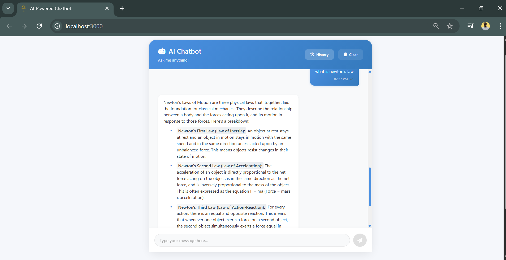
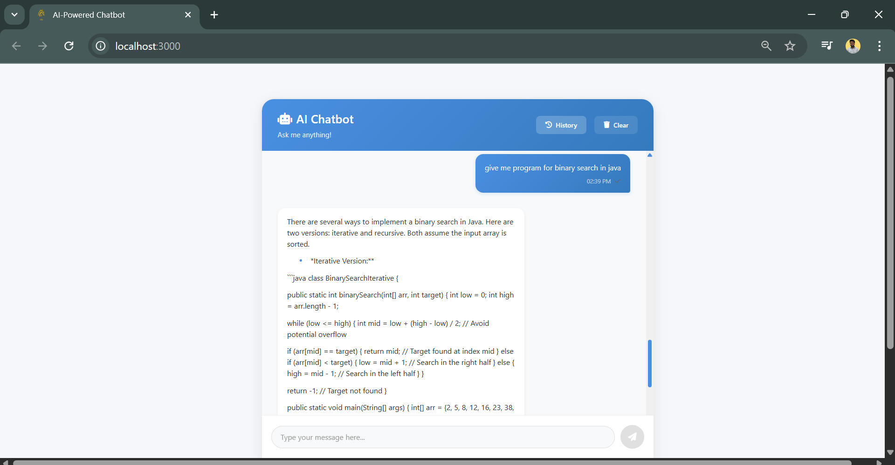
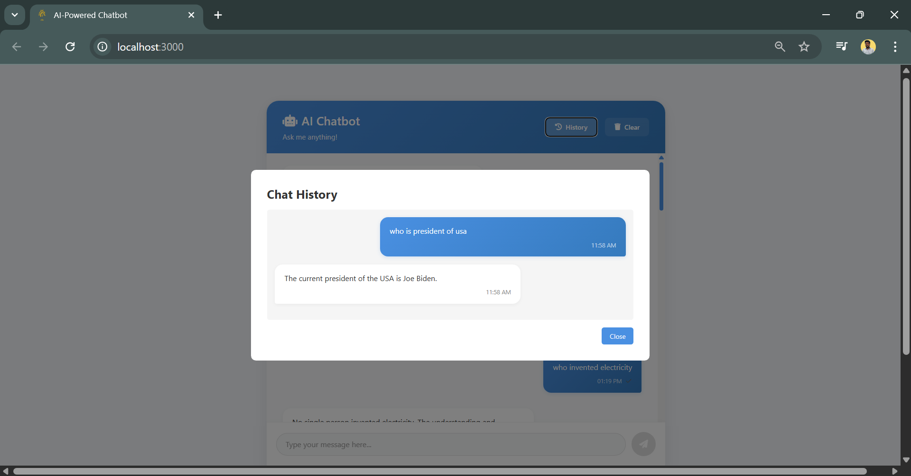

# AI-Powered Chatbot with Gemini

A modern, real-time chat application powered by Google's Gemini AI, built with the MERN stack (MongoDB, Express.js, React.js, Node.js).

⭐ If you find this project useful, please give it a star on GitHub!



## Features

- 🤖 **AI-Powered Responses**: Utilizes Google's Gemini AI for intelligent and contextual responses
- 💬 **Real-time Chat**: Instant messaging with Socket.io for seamless communication
- 📱 **Modern UI**: Clean, responsive design with beautiful message formatting
- 📊 **Message History**: Persistent chat history stored in MongoDB
- 🔄 **Real-time Updates**: Live typing indicators and message status
- 📱 **Mobile Responsive**: Works seamlessly across all devices

## Tech Stack

- **Frontend**: React.js, Socket.io-client, CSS3
- **Backend**: Node.js, Express.js
- **Database**: MongoDB
- **AI Integration**: Google Gemini API
- **Real-time Communication**: Socket.io
- **Styling**: Custom CSS with modern design principles

## Screenshots

### Chat Interface




### Chat History


## Getting Started

### Prerequisites

- Node.js (v14 or higher)
- MongoDB
- Google Gemini API key

### Installation

1. Clone the repository:
```bash
git clone https://github.com/adityasrivastava29/ai-powered-chatbot.git
cd ai-powered-chatbot
```

2. Install dependencies:
```bash
# Install backend dependencies
cd Backend
npm install

# Install frontend dependencies
cd ../Frontend
npm install
```

3. Configure environment variables:
Create a `.env` file in the Backend directory:
```env
MONGODB_URI=your_mongodb_uri
GEMINI_API_KEY=your_gemini_api_key
PORT=5000
```

4. Start the development servers:
```bash
# Start backend server
cd Backend
npm run dev

# Start frontend server
cd ../Frontend
npm start
```

## Features in Detail

### AI Integration
- Powered by Google's Gemini AI for intelligent responses
- Context-aware conversations
- Natural language processing

### Real-time Features
- Instant message delivery
- Typing indicators
- Message status (sent, delivered, read)
- Online/offline status

### User Interface
- Clean and modern design
- Responsive layout
- Beautiful message formatting
- Custom scrollbars
- Smooth animations

### Message Formatting
- Bold text support (`**text**`)
- Bullet points
- Clickable URLs
- Proper paragraph spacing
- Code block support

## Project Structure

```
ai-powered-chatbot/
├── Backend/
│   ├── config/
│   ├── controllers/
│   ├── models/
│   ├── routes/
│   ├── services/
│   └── server.js
├── Frontend/
│   ├── public/
│   ├── src/
│   │   ├── components/
│   │   ├── App.js
│   │   └── index.js
│   └── package.json
└── README.md
```

## Contributing

Contributions are welcome! Please feel free to submit a Pull Request.

## License

This project is licensed under the MIT License - see the LICENSE file for details.

## Acknowledgments

- Google Gemini AI
- Socket.io
- MongoDB
- React.js
- Express.js
